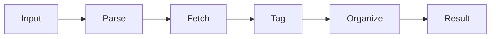

# bandcamp-download-helper 🎧⬇️

  

*One weekend, one obsession: a Bandcamp downloader that just gets your music without the fuss.*

  

One quiet Saturday, a single stubborn thought turned into the tool thousands of crate-diggers now rely on.

<strong>📖 The full story — click to expand</strong>

 

It started with a playlist of forty albums bought fair and square across a decade of supporting independent musicians, and a laptop that refused to keep them all organized. Browser tabs multiplied. Downloads landed in random folders. Filenames turned into a soup of catalog numbers and track hashes.

So a weekend was spent building **bandcamp-download-helper** — a small, focused Windows utility whose only job is to take a Bandcamp page, understand it, and hand back clean, properly tagged audio files without any of the surrounding chaos. What began as a personal fix for a personal annoyance has since grown into a project leaned on by playlist hoarders, DJs archiving sets, and label owners backing up their own catalogs.

There was no roadmap, no funding round, no team standup. Just curiosity, strong coffee, and a genuine respect for the artists whose work this tool is meant to help you keep — properly, locally, and on your own terms.

## 🌐 Overview

**bandcamp-download-helper** is a lightweight, standalone Windows application built for one purpose: turning a Bandcamp album or track page into a well-organized local library entry, with metadata, artwork, and folder structure handled automatically. It is not a browser extension, not a bloated media suite, and not a service that phones home — it's a purpose-built companion for anyone who treats Bandcamp as their primary music source and wants their downloads to feel as intentional as their purchases.

The Bandcamp Downloader space is full of half-finished scripts and browser plugins that break every time the site ships a redesign. This project exists because that fragility got old. Under the hood, bandcamp-download-helper parses page structure defensively, keeps a lightweight internal mapping of how Bandcamp organizes tracks and releases, and gracefully adapts when things shift — so your workflow doesn't grind to a halt over a layout tweak.

It's built for collectors who buy digital albums and want durable backups, for DJs who need clean file names and consistent tagging across a growing library, and for anyone who simply wants their Bandcamp downloads to *look* like they came from a real music library rather than a scattered Downloads folder. No account required, no subscription, no telemetry — just a tool that does its one job with quiet reliability.

  

---

## 🧩 What It Actually Does

| Capability | Why It Matters |
|---|---|
| **Direct Bandcamp Page Parsing** | Paste an album or track URL and the tool reads the page structure itself — no manual copy-pasting of individual file links. |
| **Automatic Metadata Tagging** | Artist, album, track title, and year get written straight into file tags, so your library stays searchable without manual editing. |
| **Cover Art Embedding** | Album artwork is pulled at full resolution and embedded directly into each audio file, not left as a stray JPEG in a folder. |
| **Batch Album Processing** | Queue an entire discography and let it run — one release at a time, in order, without babysitting each download. |
| **Smart Folder Structuring** | Files land pre-sorted into Artist / Album folders automatically, matching how most music players expect a library to look. |
| **Format-Aware Downloads** | Recognizes available audio formats per release and grabs the highest-quality option offered on the page. |
| **Resume-Friendly Sessions** | If a download queue is interrupted, the tool picks back up instead of forcing you to start the whole batch over. |
| **Lightweight Standalone Footprint** | One executable, no background services, no installer bloat — it runs, does the job, and gets out of your way. |

> [!TIP]
> Queue an entire artist's back catalog in one go — the batch processor happily works through dozens of releases while you do literally anything else.

---

## 🚀 Getting Started

Getting up and running takes less time than reading this section.

1. **Visit the landing page** using the download button above or below — this is the only official source for the tool.

2. **Download the latest build** for Windows; no account, sign-up, or license key is needed.

3. **Run the executable directly** — there's no installer wizard, no bundled extras, no surprise toolbar offers.

4. **Paste a Bandcamp album or track URL** into the app, hit start, and watch your library grow.

> [!NOTE]
> The tool is distributed as a single standalone `.exe`. Windows SmartScreen may show a first-run notice for new, less-common executables — this is expected for small independent tools and not a sign of anything wrong.

---

## 💻 System Requirements

| Requirement | Detail |
|---|---|
| **Operating System** | Windows 10 or Windows 11 (64-bit) |
| **Dependencies** | None — fully standalone, no runtime installs required |
| **Disk Space** | Minimal; scales only with the size of your downloaded library |
| **Internet Connection** | Required, obviously — it's downloading things |
| **Admin Rights** | Not required for normal operation |

  

---

## ⚙️ How It Works

Under the hood, the workflow is deliberately simple — complexity is the enemy of reliability here.

1. **Input** — you provide a Bandcamp album or track URL.

2. **Parse** — the app reads the page's structure to identify tracks, artwork, and available formats.

3. **Fetch** — audio and artwork are retrieved directly from the source.

4. **Tag** — metadata and cover art are embedded into each file automatically.

5. **Organize** — everything is placed into a clean Artist / Album folder structure on disk.

> [!IMPORTANT]
> This tool only retrieves content that is publicly available for download on the Bandcamp page itself. It does not circumvent paywalls, purchase requirements, or any access controls — it simply automates the download-and-organize step for content you're already entitled to.

---

## 🛠️ Troubleshooting

**Q: The app says it can't parse a page — what happened?**
A: Bandcamp occasionally tweaks its page layout. Update to the latest version of the tool first; parsing logic gets patched quickly when this happens.

**Q: My downloads finished but there's no cover art embedded.**
A: Some releases publish low-resolution or missing artwork on Bandcamp's end — the tool embeds whatever the page actually provides.

**Q: Windows is warning me about an unrecognized app.**
A: This is standard SmartScreen behavior for smaller independent Windows tools. Verify you downloaded from the official landing page linked in this README, then proceed.

**Q: A batch download stopped partway through.**
A: Relaunch and re-queue the same album — completed tracks are recognized and skipped rather than re-downloaded.

**Q: Can I download a private or unreleased track?**
A: No. The tool only works with pages that are already publicly accessible for download.

**Q: File names look inconsistent across a few older albums.**
A: Very old Bandcamp releases sometimes have inconsistent source metadata; the tool tags based on what's actually published.

---

## 🎨 UI / UX Details

The interface aims for calm efficiency over visual noise — this is a tool you glance at, not one you live in.

- **Light and Dark themes**, switchable from Settings, with the app remembering your last choice on relaunch.

- **Keyboard shortcuts** for the core loop:

  - `Ctrl + V` — paste a URL directly into the queue

  - `Ctrl + Enter` — start the current download queue

  - `Ctrl + Shift + X` — clear the queue

  - `F5` — refresh queue status

- **Persistent settings** for default download folder, preferred audio format priority, and folder-naming convention.

- **Minimal, single-window layout** — no nested menus five levels deep, no dashboard you need a tutorial for.

> [!TIP]
> Set your default download folder once in Settings and every future batch respects it automatically — no repeated folder prompts.

---

## 🤝 Contributing & Community

This started as a solo weekend build, but it hasn't stayed that way — and that's the best part.

> [!NOTE]
> Issues, feature requests, and pull requests are genuinely welcome. Bug reports with a specific Bandcamp URL (where the content is public) are especially helpful for reproducing parsing issues quickly.

If you're interested in contributing:

1. Open an issue describing the behavior you're seeing or the feature you'd like.

2. Discuss the approach before large changes — keeps everyone's time efficient.

3. Submit a focused pull request; smaller, well-scoped changes get reviewed faster.

Community energy is what keeps a tool like this sharp — every report and suggestion nudges it toward being a little more solid.

---

## 📜 License

Released under the [MIT License](LICENSE), 2026. Use it, learn from it, build on it — just keep the license notice intact.

---

## ⚠️ Disclaimer

> [!WARNING]
> bandcamp-download-helper is an independent tool and is not affiliated with, endorsed by, or associated with Bandcamp in any way. It is intended strictly for downloading content that is already publicly available for download or that you have legitimately purchased. Please respect artists, labels, and Bandcamp's own terms of service — this project exists to support independent music, not to undermine it.

  

